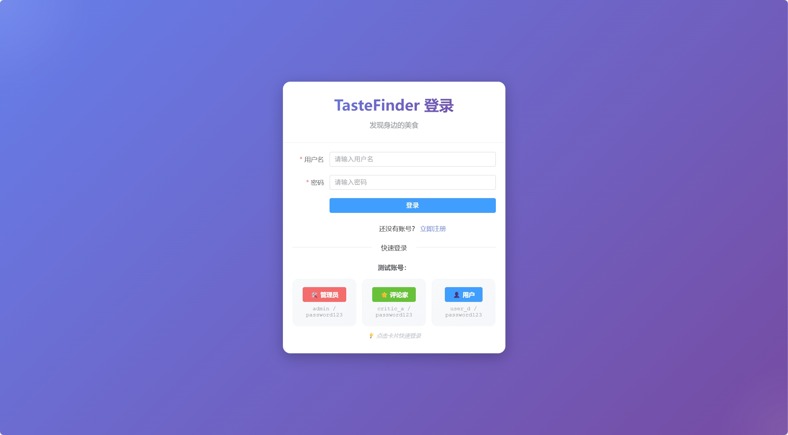
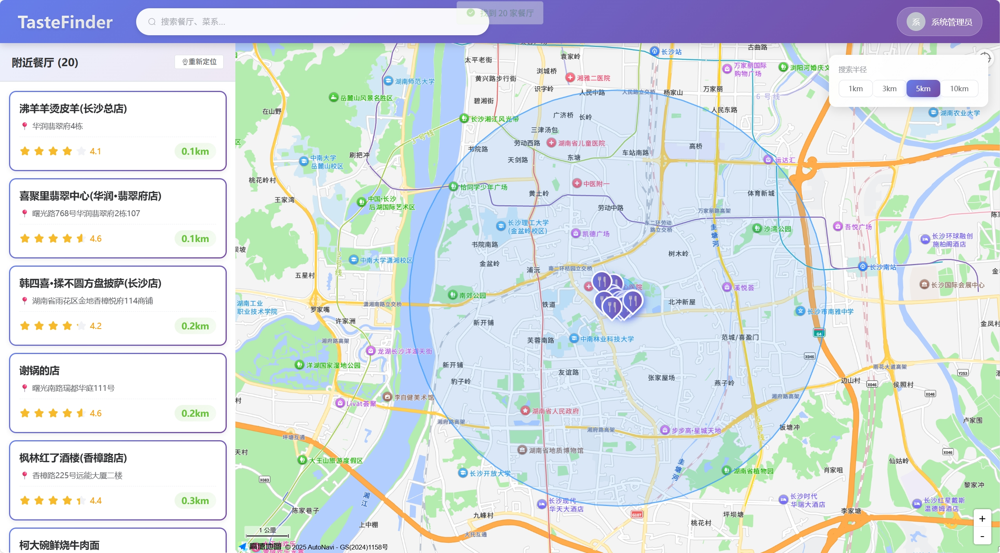
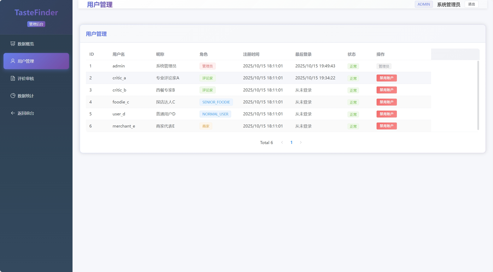

# 🍽️ TasteFinder 美食推荐平台

<div align="center">


**基于地理位置的智能美食推荐系统**

[在线演示](http://os8vc9406212.vicp.fun) · [快速开始](#快速开始) · [功能文档](specs/001-tastefinder-api/spec.md)

</div>

---

## 📖 项目简介

TasteFinder是一个现代化的美食推荐平台，集成高德地图API，提供实时餐厅搜索、路径规划、收藏管理和用户评价等完整功能。

### ✨ 核心特性

- 🗺️ **交互式地图** - 高德地图集成，可视化餐厅分布
- 📍 **智能搜索** - 基于位置的POI搜索，Redis缓存优化
- 🧭 **路径导航** - 驾车/步行/公交三种方式，实时路径规划
- ⭐ **餐厅收藏** - POI快照存储，永久保存
- 💬 **用户评价** - 先发后审机制，认证评论家徽章
- 🛠️ **后台管理** - 用户管理、评价审核、数据统计

---

## 🎨 界面预览

<div align="center">

### 登录界面


### 地图主界面


### 管理后台


</div>

---

## 🚀 快速开始

### 前置要求

- Docker Desktop 20.10+
- Java JDK 17+
- Node.js 18+
- Maven 3.8+（或使用项目自带）

### 一键启动

```bash
# 克隆项目
git clone https://github.com/bz1121/Food.git
cd Food

# 配置环境变量
cp frontend/.env.example frontend/.env.development
# 编辑 frontend/.env.development，填入你的高德API密钥

# 一键启动所有服务
start.bat  # Windows

# 访问应用
http://localhost:5173
```

详细说明见：[快速开始指南](specs/001-tastefinder-api/quickstart.md)

---

## 🏗️ 技术架构

### 后端技术栈

- **Spring Boot 3.1.5** - 核心框架
- **Spring Security + JWT** - 认证授权
- **Spring Data JPA** - ORM框架
- **MySQL 8.0** - 主数据库
- **Redis 7.x** - 缓存服务
- **Flyway** - 数据库迁移
- **Springdoc OpenAPI** - API文档

### 前端技术栈

- **Vue 3** - 渐进式框架
- **Vite 4** - 构建工具
- **Pinia** - 状态管理
- **Element Plus** - UI组件库
- **高德地图 API 2.0** - 地图服务
- **Axios** - HTTP客户端

### DevOps

- **Docker & Docker Compose** - 容器化
- **GitHub Actions** - CI/CD
- **Nginx** - 反向代理
- **Checkstyle + ESLint** - 代码质量

---

## 📊 项目特点

### 完整性

- ✅ 120+个文件
- ✅ 9000+行代码
- ✅ 30000+字文档
- ✅ 18个API端点
- ✅ 6种用户角色
- ✅ 完整的管理后台

### 代码质量

- ✅ 遵循项目宪章
- ✅ Checkstyle代码检查
- ✅ 10+个单元测试
- ✅ 完整的Javadoc
- ✅ 统一的命名规范

### 性能优化

- ✅ Redis缓存（减少80% API调用）
- ✅ 分批渲染（避免卡顿）
- ✅ 数据库索引优化
- ✅ 前端代码分割
- ✅ 60fps流畅体验

### UI设计

- ✅ 紫色渐变主题
- ✅ 毛玻璃效果
- ✅ 流畅动画
- ✅ 响应式设计
- ✅ 统一视觉语言

---

## 🎯 功能清单

### 用户功能

- ✅ 用户注册登录（JWT认证）
- ✅ 地图浏览和餐厅搜索
- ✅ 路径规划和导航
- ✅ 餐厅收藏管理
- ✅ 发表和管理评价
- ✅ 个人中心

### 管理功能

- ✅ 数据统计概览
- ✅ 用户管理（启用/禁用）
- ✅ 评价审核（删除/恢复）
- ✅ 角色权限控制

---

## 📚 文档

### 技术文档

- [功能规范](specs/001-tastefinder-api/spec.md) - 完整的产品需求
- [实施计划](specs/001-tastefinder-api/plan.md) - 详细的技术方案
- [数据模型](specs/001-tastefinder-api/data-model.md) - 数据库设计
- [API规范](specs/001-tastefinder-api/contracts/openapi.yaml) - RESTful API

### 部署文档

- [快速开始](specs/001-tastefinder-api/quickstart.md)
- [部署指南](DEPLOYMENT_GUIDE.md)
- [Ubuntu部署](UBUNTU_DEPLOYMENT_GUIDE.md)
- [性能优化](PERFORMANCE_OPTIMIZATION.md)

### 开发文档

- [贡献指南](CONTRIBUTING.md)
- [安全策略](SECURITY.md)
- [更新日志](CHANGELOG.md)

---

## 🔑 测试账户

| 用户名 | 密码 | 角色 | 说明 |
|--------|------|------|------|
| admin | password123 | 管理员 | 可访问后台管理 |
| critic_a | password123 | 美食评论家A | 评价带认证徽章 |
| critic_b | password123 | 西餐专家B | 评价带认证徽章 |
| foodie_c | password123 | 探店达人 | 普通功能 |
| user_d | password123 | 普通用户 | 普通功能 |
| merchant_e | password123 | 商家代表 | 查看统计 |

---

## 🛠️ 开发

### 本地开发

```bash
# 后端
cd backend
mvn spring-boot:run

# 前端
cd frontend
npm install
npm run dev
```

### 运行测试

```bash
# 后端测试
cd backend
mvn test

# 前端测试
cd frontend
npm run test
```

### 代码质量检查

```bash
# 后端
mvn checkstyle:check

# 前端
npm run lint
```

---

## 📦 部署

### Docker部署（推荐）

```bash
# 生产环境部署
docker-compose -f docker-compose.prod.yml up -d

# 查看日志
docker-compose logs -f

# 停止服务
docker-compose down
```

### Ubuntu服务器部署

详见：[Ubuntu部署指南](UBUNTU_DEPLOYMENT_GUIDE.md)

推荐使用宝塔面板 + Docker部署。

---

## 🤝 贡献

欢迎提交Issue和Pull Request！

请阅读 [贡献指南](CONTRIBUTING.md) 了解详情。

---

## 📄 许可证

本项目采用 [MIT许可证](LICENSE)

---

## 🙏 致谢

- [Spring Boot](https://spring.io/projects/spring-boot)
- [Vue.js](https://vuejs.org/)
- [Element Plus](https://element-plus.org/)
- [高德地图](https://lbs.amap.com/)

---

## 📞 联系方式

- 项目主页：[GitHub](https://github.com/your-username/tastefinder)
- 问题反馈：[Issues](https://github.com/your-username/tastefinder/issues)
- 邮件：dev@tastefinder.com

---

<div align="center">

**⭐ 如果这个项目对你有帮助，请给个Star！ ⭐**

Made with ❤️ by TasteFinder Team

</div>
